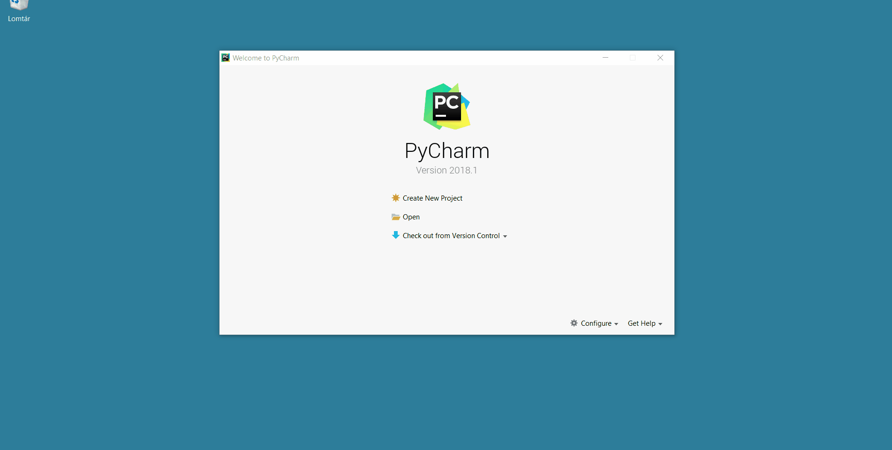

# Selenium telepítés

## Selenium IDE telepítés

A használni kívánt böngészőben (Firefox vagy Chrome) nyisd meg 
a https://www.seleniumhq.org/selenium-ide/ oldalt, és klikkelj a böngészőnek
megfelelő _Download_ gombra!

Chrome esetén a chrome web store jelenik, meg, és jobb oldalon 
klikkelj rá az _Add to Chrome_ gombra! Ekkor megjelenik egy megerősítő ablak,
_Add "Selenium IDE"?_ kérdéssel. Kattints az _Add extension_ gombra! A 
jobb felső sarokban megjelenik egy felirat, hogy a telepítés sikeres.
  
Firefox esetén a Firefox Add-ons oldal kerül megjelenítésre. Itt kattints az
_Add to Firefox_ gombra! Ekkor megjelenik egy megerősítő ablak,
_Add "Selenium IDE"?_ kérdéssel. Kattints az _Add_ gombra! A 
jobb felső sarokban megjelenik egy felirat, hogy a telepítés sikeres.

Ekkor már rá is lehet kattintani a Selenium IDE ikonjára, ami az _Se_, és mellette egy kis
videókamera. Ekkor köszönt az IDE _Welcome to Selenium IDE!_ felirattal, és
el lehet kezdeni a munkát a négy link valamelyikére való kattintással (pl. 
  _Record a new test in a new project_).

## Python futtatókörnyezet telepítése

Látogass el a https://www.python.org/downloads/ oldalra, és ott kattints a
_Download Python 3.8.0_ gombra.

Windows esetén egy `exe` fájl kerül letöltésre, ezt indítsd el, 
és telepítsd fel alapbeállításokkal!

## PyCharm futtatókörnyezet telepítése

Látogass el a https://www.jetbrains.com/pycharm/download/ oldalra, és ott
kattints a _Download_ gombra! A _Community_ felirat alatti _Download_
gombra kattints!

Windows esetén egy `exe` fájl kerül letöltésre, ezt indítsd el, 
és telepítsd fel alapbeállításokkal!

Linux esetén egy `tar.gz` kerül letöltésre, ezt csak ki kell csomagolni, 
és a `bin/pycharm.sh` paranccsal indítható.

## Új projekt létrehozása

Indítsd el a PyCharm IDE-t! Kattints a `Create New Project` gombra, majd
add meg a könyvtárat, ahol a projekted legyen! Ez a könyvtár, vagy legyen üres,
vagy ne is létezzen. A könyvtár neve legyen `locations-test`, és elhelyezheted akár a home 
könyvtáradban, akár a `D:` meghajtó gyökerében is. Ha nem létezik, a PyCharm rákérdez, hogy létrehozza-e.

Ha megnyílik a PyCharm fő ablaka, bal felül a _Project_ ablakban,
a projekt nevén (`locations-test`) kattints a jobb egérgombbal, majd 
_New > Python File_, majd névnek add meg, hogy `hello`.

A megjelenő üres ablakba írd be a következő kódot!

```python
print("Hello Python!")
```

Futtasd le a programot, jobb egérgombbal, majd _Run 'hello'_. A _Ctrl + Shift + F10_
is működik.

### Betűméret növelése

A _File > Settings_ menüponton belül rá kell keresni a bal felső keresőmezőben a 
`Zoom` szövegre, és kiválasztani a _Editor > General_ menüt, és ott be kell
betenni a _Change font size (Zoom) with Ctrl + Mouse Wheel_ pipát. Ennek hatására
a szerkesztőablakban Ctrl + görgő segítségével növelhető/csökkenthető a betűméret.

## Driver letöltése és kicsomagolása

Chrome esetén a ChromeDrivert tölts le a https://chromedriver.chromium.org/
címről!

Firefox esetén a https://github.com/mozilla/geckodriver/releases címről
töltsd le a geckodriver programot! 

Mindkettő egy `zip` fájl, amiben egy `exe`
fájl van, és ezt egy olyan könyvtárban helyezd el, ami benne van a `PATH`-ban!
A legegyszerűbb a `C:\Windows` könyvtárban elhelyezni.  Ehhez adminisztrátori
jogosultság szükséges.

Linux és Mac esetén a ChromeDriver nem futtatható, ezért futtathatóvá kell
tenni a `chmod +x chromedriver` paranccsal.

Chrome esetén a parancssorban bármelyik könyvtárban kiadva a `chromedriver` parancsot,
elindul, és valami hasonlót ír ki.

```
Starting ChromeDriver 77.0.3865.40 (f484704e052e0b556f8030b65b953dce96503217-refs/branch-heads/3865@{#442}) on port 9515
Only local connections are allowed.
Please protect ports used by ChromeDriver and related test frameworks to prevent access by malicious code.
```

Firefox esetén a parancssorban bármelyik könyvtárban kiadva a `geckodriver` parancsot,
elindul, de nem ír kis semmit.

Miután elindítottad, nyugodtan szakítsd meg (_Ctrl + C_), mert a Selenium WebDriver
majd maga fogja elindítani.

## Első Selenium WebDriver szkript létrehozása

Hozd létre a `requirements.txt` állományt! Bal felül a _Project_ ablakban,
a projekt nevén (`locations-test`) kattints a jobb egérgombbal, majd 
_New > File_, majd névnek add meg, hogy `requirements.txt`!

Ez az állomány tartalmazza azt, hogy mit szeretnél a Python projektedben használni.
Add meg, hogy a Selenium WebDrivert, ehhez elég csak a következőt beírni:

```
selenium
```

A fájl tetején megjelenik egy szöveg: _Package requirement 'selenium' is
not satisfied_. Kattints az _Install requirement_ linkre! Ekkor az internetről
letölti a Selenium WebDrivert a `venv` könyvtárba.

Majd hozz létre egy új Python fájlt, `locations-simple` néven. (Vigyázz, ne egyszerű fájl, hanem Python fájl.) Másold be a következő
kódot!

```python
from selenium import webdriver
from selenium.webdriver.common.by import By

driver = webdriver.Chrome()

driver.get("http://www.learnwebservices.com//locations/server")
driver.find_element(By.ID, "nameInput").send_keys("Selenium")

# driver.quit()
```

Ekkor elindul egy Chrome, és beírja a név beviteli mezőbe, hogy `Selenium`.

Amennyibe Firefoxot szeretnél indítani, a `driver =` kezdetű sort cseréld le a következőre.
(Vigyázz, ekkor a geckodrivernek telepítve kell lenne.)

```
driver = webdriver.Firefox()
```

Linux, Mac esetén add meg a ChromeDriver elérési útját is, pl.:

```
driver = webdriver.Chrome("/home/trainer/chromedriver")
```


## Selenium IDE teszteset exportálás

A teszteseten nyomd meg a jobb egérgombot, majd válaszd ki az _Export_ menüt,
majd _Python pytest_! (Ha nincs teszteseted, vegyél fel egy két klikkből állót!)
Mentsd el a fájlt, majd hozz létre a a Python projekted főkönyvtárában egy `test`
könyvtárat, és másold ide a fájlt! Ekkor
megjelenik a PyCharmban is a `test` könyvtárban. (Vigyázz, más könyvtárnév nem jó,
mindenképp a `test` könyvtárban legyen!)

Vedd fel a `requirements.txt` állományba a `pytest` sort, ezzel mondod meg, hogy 
a pytest unit test keretrendszert is használni akarod a projektben. Ugyanis a Selenium IDE
olyan kódot generál, ami ezt használja. Ekkor a `requirements.txt` állomány tartalma:

```
selenium
pytest
```

Kattints az _Install requirement_ linkre!

Ha megnyitod az exportált és bemásolt `.py` kiterjesztésű állományt, akkor már
nem szabad benne pirossal aláhúzott szövegnek lennie.

Sajnos ez az állomány közvetlenül nem futtatható. Ehhez a videó által bemutatott
lépéseket kell elvégezni. Természetesen az elején az állományok létrehozását nem kell megcsinálnod, csak a beállításokat. Ez a _File > Settings_ menüpontban, a _Default test runner_ szövegre kell rákeresni, és átállítani `pytest` értékre. Ezután megjelenik
a teszt fájlban egy zöld nyíl, erre kattintva indítható a teszteset.

