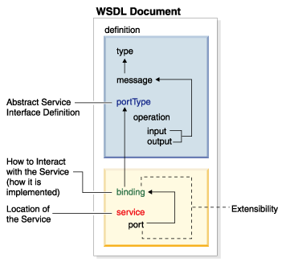

class: inverse, center, middle

# SOAP webszolgáltatások és API tesztelés SoapUI-jal

---

## XML formátum

* Általános célú leíró nyelv (W3C szabvány)
* Bővíthető
* Ember és számítógép által is feldolgozható szöveges formátum
* Fa hierarchia

---

## XML szintaktika

* Tagek és attribútumaik
* Egy gyökér tag lehet
* Nyitó taghez tartoznia kell egy lezáró tagnek is (vagy önzáró tag)
* A tagek egymásba ágyazhazók, de nem lehet átfedés
* Jól formáltság (well-formed)
* Kis- és nagybetű különbség

---

## Példa XML állomány

```xml
<?xml version="1.0" encoding="UTF-8" standalone="no"?>
<!-- Catalog of books -->
<catalog>    
    <book isbn10="059610149X">
        <title>Java and XML</title>
        <available />
    </book>
    <book isbn10="1590597060">
        <title>Pro XML Development with Java Technology</title>
    </book>
</catalog>
```

---

## XML névterek

* Két különböző dokumentumban ugyanaz a elem név hordozhat más jelentést
* Probléma lehet, ha a dokumentumokat egymásba kell ágyazni
* Névütközés
* Névtér legyen egyedi URL, amivel minősítjük a elemeket
    * Az adott URL-en nem kell tartalomnak lennie
* Teljes URL kiírása helyett használjunk rövidítéseket (prefix)


---

## Névterek

```xml
<?xml version="1.0" encoding="UTF-8" standalone="no"?>
<!-- Catalog of books -->
<c:catalog xmlns:c="http://www.learnwebservices.com/schemas/catalog"
    xmlns:s="http://www.learnwebservices.com/schemas/stock">    
    <c:book isbn10="1590597060">
        <c:title>Pro XML Development with Java Technology</c:title>        
        <s:stock>10</s:stock>
    </c:book>
</c:catalog>
```


---

## XML szerkesztő

* Legtöbb szövegszerkesztő támogatja
  * Pl. Notepad++ XML Tools Plugin
* Fejlesztőeszközök támogatják
* Altova XMLSpy

---

## Validáció

* Szabályrendszerek
    * Elemek (_tag_) nevei
    * Mit tartalmazhatnak (más elemeket, vagy szövegeket - ezekhez típus is rendelhető)
    * Tartalmazott elemek multiplicitása
    * Attribútumok nevei - típus is rendelhető
* Séma: a dokumentumok felépítését és formáját leíró formális nyelv
* Valid, ha megfelel a sémának
* Csak jól formázott XML dokumentumot lehet validálni
* Séma leírása külön dokumentumban, DTD vagy XML séma (XSD)

---

## Belső DTD

```xml
<?xml version="1.0" encoding="UTF-8" standalone="no"?>
<!DOCTYPE catalog [
<!ELEMENT catalog (book*)>
<!ELEMENT book (title, available?)>
<!ATTLIST book isbn10 CDATA #REQUIRED>
<!ELEMENT title (#PCDATA)>
<!ELEMENT available EMPTY>
]>
<!-- Catalog of books -->
<catalog>    
    <book isbn10="059610149X">
        <title>Java and XML</title>
        <available />
    </book>
</catalog>
```

---

## XML séma

* XSD szabvány (W3C)
* Önmaga is XML formátumú
* Valid
* Adattípusok, pl. `string`, `decimal`, `float`, `date`
* Dokumentálásra is használható
* XML névterek használata

---

## Példa XML séma

```xml
<xs:schema xmlns:xs="http://www.w3.org/2001/XMLSchema">
  <xs:element name="catalog">
    <xs:annotation>
      <xs:documentation>Catalog of books</xs:documentation>
    </xs:annotation>
    <xs:complexType>
      <xs:sequence>
        <xs:element name="book" minOccurs="0" maxOccurs="unbounded">
          <xs:complexType>
            <xs:sequence>
              <xs:element type="xs:string" name="title"/>
              <xs:element type="xs:string" name="available" minOccurs="0"/>
            </xs:sequence>
            <xs:attribute type="xs:string" name="isbn10" use="optional"/>
          </xs:complexType>
        </xs:element>
      </xs:sequence>
    </xs:complexType>
  </xs:element>
</xs:schema>
```

---

## XPath

* W3C szabvány
* Egy XML dokumentum elemei és attribútumai közötti navigációt biztosítja
* XPath szintaktika segítségével definiálhatjuk az XML dokumentum részeit
* Kifejezések segítségével mozoghatunk az XML dokumentumban
* Tartalmaz egy standard függvénykönyvtárat

---

## Példa XPath kifejezések

* `catalog` – csomópont neve, kiválasztja az összes `catalog` elemet
* `/catalog` – kiválasztja a gyökérelem alatt lévő összes `catalog` elemet
* `catalog/book` – kiválasztja a `catalog` elem összes `book` gyerek elemet
* `//book` – kiválasztja a dokumentum összes `book` elemét, függetlenül annak alhelyezkedésétől
* `catalog//book` – kiválasztja a `catalog` elem összes leszármazott `book` elemét
* `//@lang` – kiválasztja az összes lang nevű attribútumot

---

## XSLT

* XSLT - XML Stylesheet Language Transformation
* Lehetővé teszi az XML dokumentumok átalakítását más XML dokumentumokká
* Erőteljesen épít az XPath-ra

---

## Példa XSLT állomány

```xml
<?xml version="1.0" encoding="UTF-8"?>
<xsl:stylesheet version="1.0"
  xmlns:xsl="http://www.w3.org/1999/XSL/Transform">
<xsl:template match="/">
  <html>
  <body>
  <h2>Catalog</h2>
  <table>
    <xsl:for-each select="/catalog/book">
    <tr>
      <td><xsl:value-of select="title"/></td>
      <td><xsl:if test="available">available</xsl:if></td>
    </tr>
    </xsl:for-each>
  </table>
  </body>
  </html>
</xsl:template>
</xsl:stylesheet>
```

---

## Webszolgáltatások

* W3C definíció: hálózaton keresztüli gép-gép együttműködést támogató szoftverrendszer
* Platform független
* Szereplők
	* Szolgáltatást nyújtó
	* Szolgáltatást használni kívánó

---

## SOAP

* XML alapú üzenetformátum, W3C szabány
* SOAP boríték: fejléc és törzs


---

## Példa SOAP kérés és válasz

```xml
<?xml version="1.0"?>
<soap:Envelope xmlns:soap="http://www.w3.org/2003/05/soap-envelope">
  <soap:Header>
    <headers:RequestId xmlns:headers="http://www.example.org/stock/headers"
         env:mustUnderstand="0">93e12b33-6511-4bf4-9310-69cd13e60b44</headers:RequestId>
  </soap:Header>
  <soap:Body>
    <m:GetStockPrice xmlns:m="http://www.example.org/stock">
      <m:StockName>IBM</m:StockName>
    </m:GetStockPrice>
  </soap:Body>
</soap:Envelope>
```

```xml
<?xml version="1.0"?>
<soap:Envelope xmlns:soap="http://www.w3.org/2003/05/soap-envelope">
  <soap:Body>
    <m:GetStockPriceResult xmlns:m="http://www.example.org/stock">
      <m:StockName>IBM</m:StockName>
      <m:StockPrice>13 $</m:StockPrice>
    </m:GetStockPriceResult>
  </soap:Body>
</soap:Envelope>
```


---

## WSDL

* Interfészleíró nyelv, XML alapú, W3C szabvány
* Építhet az XSD sémára
* [Példa WSDL dokumentum](https://hu.wikipedia.org/wiki/Webszolg%C3%A1ltat%C3%A1s-le%C3%ADr%C3%B3_nyelv)
* Tipikusan generált, vagy eszközből összeállított

---

## WSDL felépítése



---

## Implementációs megközelítések

* Top down: WSDL alapján
* Bottom up: kód alapján
* Meet in the middle

---

## SoapUI

* REST and SOAP testing tool
* Különböző kiadások
    * Open Source
    * Professional (ReadyAPI csomag része)

---

## SoapUI Pro

* Követelmények kezelése
* Több környezet támogatása
    * Service URL-ek, JDBC kapcsolatok, változók (properties)
* Data Driven Testing (beolvasás és kiírás különböző formátumokban)
* Lefedettség WSDL alapján
* Test assertion támogatás (pl. XPath generálás)
* CI/CD integráció
* Reporting (különböző formátumokban)
* Support

---

## Data Driven Testing

* Adatok beolvasása különböző forrásokból: Excel, XML, JDBC, CSV, stb.
* Kérések (XML) beolvasása fájlból
* Data Generator: adatgenerálás (pl. véletlenszám, script, stb.)
* Adatbázisba mentés
        
---

## Használható

* Különböző webszolgáltatások tesztelésére: SOAP és REST
* API funkcionális tesztelés
* Teljesítmény tesztelés
* Biztonság tesztelése

---

## Egyéb tulajdonságok

* Mockolás (szimuláció)
* Groovy szkriptelhetőség
* Parancssori futtatás
* Data-Driven Testing
* Jelentéskészítés

---

## Első projekt (gyakorlat)

* Új projekt létrehozása WSDL alapján
* Példa request létrehozása futtatása

---

## Projekt kezelése

* Save project
* Import project

---

## Teszt csomagok

* TestSuite
* TestCase
* Test Step
    * SOAP Request
    * Assert: contains, XPATH
    
```
declare namespace l='http://www.learnwebservices.com/locations'
//l:location/l:name
```

---

## További Test Step fajták

* Run Testcase (másik teszteset meghívása)
* Properties (változók deklarálása)
* Property Transfer
* Assert létrehozása

---

## Változók használata

```
<userName>${#TestCase#username}</userName>
```

---

## Property transfer

* Előző response-ból adat áthozatala következő requestbe

```
declare namespace l='http://www.learnwebservices.com/locations'
//l:location/l:id

//l:updateLocationRequest/l:id
```

---

## JDBC Test Step

* `mariadb-java-client-2.4.1.jar` a `lib` könyvtárba
* Driver: `org.mariadb.jdbc.Driver`
* Connection string: `jdbc:mysql://localhost:3306/testdb?user=testuser&password=testpwd`

---

## Load test

* Fajtái
  * Baseline
  * Load
  * Stress
  * Soak (hosszan futó)
  * Scalability
* Load Test
  * Assertálható
  * Exportálható

---

## SOAP Service Mocking

* Webszolgáltatás prototípus
* Pl. kliens alkalmazások tesztelésére
